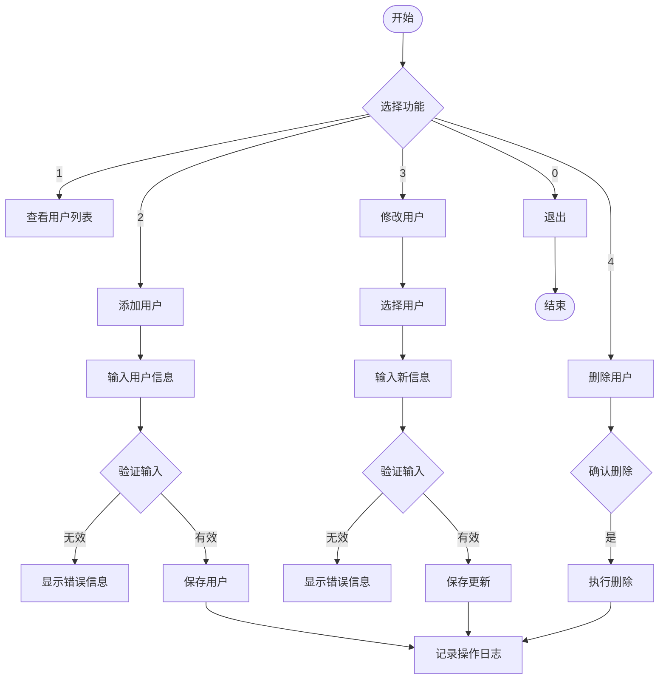

```mermaid
flowchart TD
    Start([开始]) --> SelectFunction{选择功能}
    
    SelectFunction -->|1| UserList[查看用户列表]
    SelectFunction -->|2| AddUser[添加用户]
    SelectFunction -->|3| UpdateUser[修改用户]
    SelectFunction -->|4| DeleteUser[删除用户]
    SelectFunction -->|0| Exit[退出]
    
    AddUser --> InputUserInfo[输入用户信息]
    InputUserInfo --> ValidateInput{验证输入}
    ValidateInput -->|无效| ShowInputError[显示错误信息]
    ValidateInput -->|有效| SaveUser[保存用户]
    SaveUser --> LogOperation[记录操作日志]
    
    UpdateUser --> SelectUser[选择用户]
    SelectUser --> InputNewInfo[输入新信息]
    InputNewInfo --> ValidateNewInput{验证输入}
    ValidateNewInput -->|无效| ShowUpdateError[显示错误信息]
    ValidateNewInput -->|有效| SaveUpdate[保存更新]
    SaveUpdate --> LogOperation
    
    DeleteUser --> ConfirmDelete{确认删除}

    ConfirmDelete -->|是| ExecuteDelete[执行删除]
    ExecuteDelete --> LogOperation
    

    Exit --> End([结束]) 
```