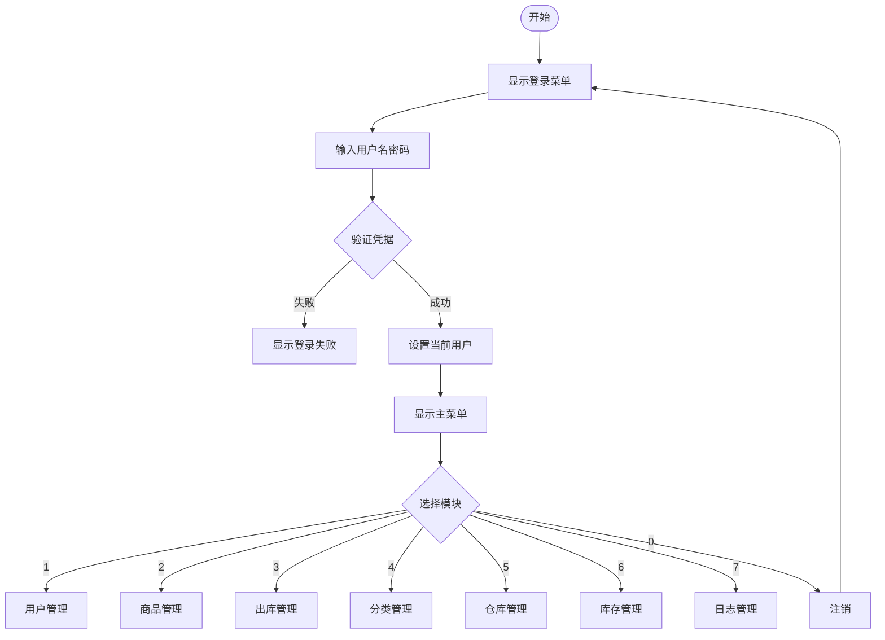

```mermaid
flowchart TD
    Start([开始]) --> ShowLoginMenu[显示登录菜单]
    ShowLoginMenu --> InputCredentials[输入用户名密码]
    InputCredentials --> ValidateCredentials{验证凭据}
    ValidateCredentials -->|失败| ShowError[显示登录失败]
    ValidateCredentials -->|成功| SetCurrentUser[设置当前用户]
    SetCurrentUser --> ShowMainMenu[显示主菜单]
    ShowMainMenu --> SelectModule{选择模块}
    SelectModule -->|1| UserManage[用户管理]
    SelectModule -->|2| GoodsManage[商品管理]
    SelectModule -->|3| StockOutManage[出库管理]
    SelectModule -->|4| CategoryManage[分类管理]
    SelectModule -->|5| WarehouseManage[仓库管理]
    SelectModule -->|6| InventoryManage[库存管理]
    SelectModule -->|7| LogManage[日志管理]
    SelectModule -->|0| Logout[注销]
    Logout --> ShowLoginMenu 
```