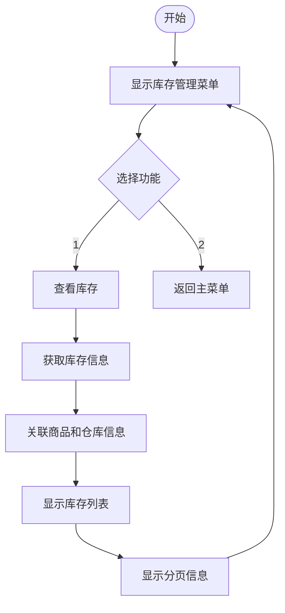

```mermaid
flowchart TD
    Start([开始]) --> ShowMenu[显示库存管理菜单]
    ShowMenu --> SelectFunction{选择功能}
    
    SelectFunction -->|1| ViewInventory[查看库存]
    SelectFunction -->|2| ReturnMain[返回主菜单]
    
    ViewInventory --> GetInventory[获取库存信息]
    GetInventory --> JoinTables[关联商品和仓库信息]
    JoinTables --> DisplayInventory[显示库存列表]
    DisplayInventory --> ShowPagination[显示分页信息]
    ShowPagination --> ShowMenu 
```