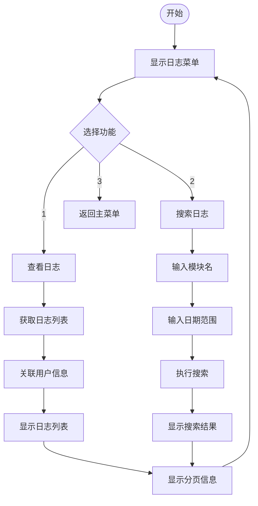

```mermaid
flowchart TD
    Start([开始]) --> ShowMenu[显示日志菜单]
    ShowMenu --> SelectFunction{选择功能}
    
    SelectFunction -->|1| ViewLogs[查看日志]
    SelectFunction -->|2| SearchLogs[搜索日志]
    SelectFunction -->|3| ReturnMain[返回主菜单]
    
    ViewLogs --> GetLogs[获取日志列表]
    GetLogs --> JoinUsers[关联用户信息]
    JoinUsers --> DisplayLogs[显示日志列表]
    DisplayLogs --> ShowPagination[显示分页信息]
    
    SearchLogs --> InputModule[输入模块名]
    InputModule --> InputDateRange[输入日期范围]
    InputDateRange --> ExecuteSearch[执行搜索]
    ExecuteSearch --> DisplayResults[显示搜索结果]
    DisplayResults --> ShowPagination
    ShowPagination --> ShowMenu 
```