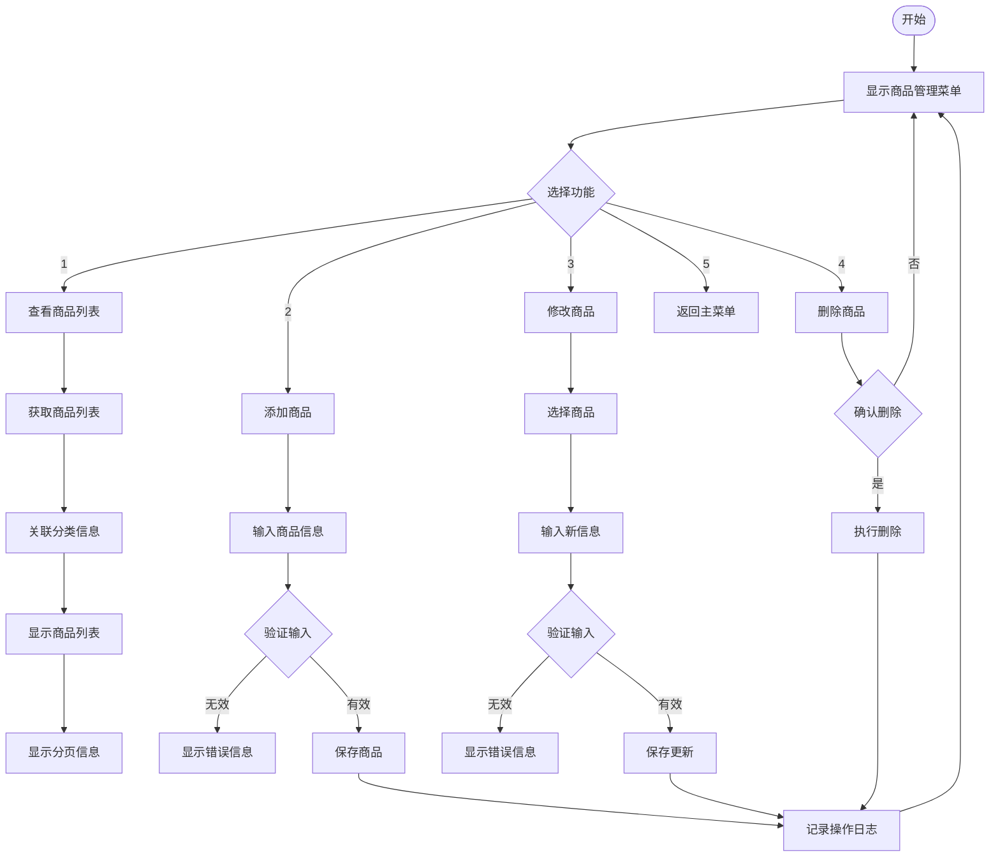

```mermaid
flowchart TD
    Start([开始]) --> ShowMenu[显示商品管理菜单]
    ShowMenu --> SelectFunction{选择功能}
    
    SelectFunction -->|1| ViewGoods[查看商品列表]
    SelectFunction -->|2| AddGoods[添加商品]
    SelectFunction -->|3| UpdateGoods[修改商品]
    SelectFunction -->|4| DeleteGoods[删除商品]
    SelectFunction -->|5| ReturnMain[返回主菜单]
    
    ViewGoods --> GetGoods[获取商品列表]
    GetGoods --> JoinCategory[关联分类信息]
    JoinCategory --> DisplayGoods[显示商品列表]
    DisplayGoods --> ShowPagination[显示分页信息]
    
    AddGoods --> InputGoodsInfo[输入商品信息]
    InputGoodsInfo --> ValidateInput{验证输入}
    ValidateInput -->|无效| ShowError[显示错误信息]
    ValidateInput -->|有效| SaveGoods[保存商品]
    SaveGoods --> LogOperation[记录操作日志]
    
    UpdateGoods --> SelectGoods[选择商品]
    SelectGoods --> InputNewInfo[输入新信息]
    InputNewInfo --> ValidateUpdate{验证输入}
    ValidateUpdate -->|无效| ShowUpdateError[显示错误信息]
    ValidateUpdate -->|有效| SaveUpdate[保存更新]
    SaveUpdate --> LogOperation
    
    DeleteGoods --> ConfirmDelete{确认删除}
    ConfirmDelete -->|否| ShowMenu
    ConfirmDelete -->|是| ExecuteDelete[执行删除]
    ExecuteDelete --> LogOperation
    
    LogOperation --> ShowMenu 
```