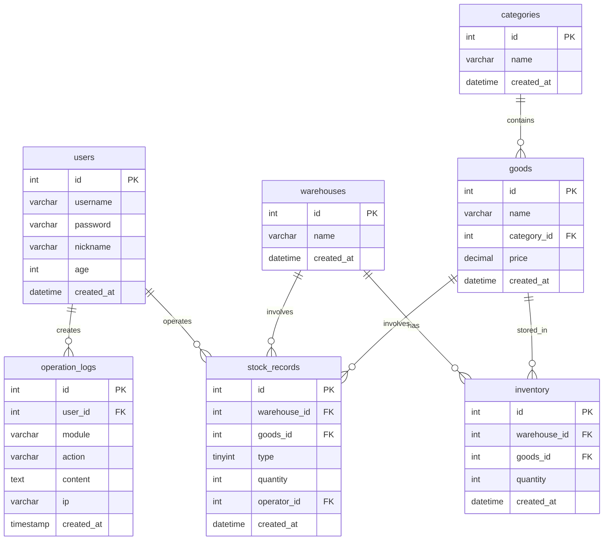

```mermaid
erDiagram
    users ||--o{ operation_logs : "creates"
    users ||--o{ stock_records : "operates"
    categories ||--o{ goods : "contains"
    warehouses ||--o{ inventory : "has"
    warehouses ||--o{ stock_records : "involves"
    goods ||--o{ inventory : "stored_in"
    goods ||--o{ stock_records : "involves"

    users {
        int id PK
        varchar username
        varchar password
        varchar nickname
        int age
        datetime created_at
    }

    categories {
        int id PK
        varchar name
        datetime created_at
    }

    goods {
        int id PK
        varchar name
        int category_id FK
        decimal price
        datetime created_at
    }

    warehouses {
        int id PK
        varchar name
        datetime created_at
    }

    inventory {
        int id PK
        int warehouse_id FK
        int goods_id FK
        int quantity
        datetime created_at
    }

    stock_records {
        int id PK
        int warehouse_id FK
        int goods_id FK
        tinyint type
        int quantity
        int operator_id FK
        datetime created_at
    }

    operation_logs {
        int id PK
        int user_id FK
        varchar module
        varchar action
        text content
        varchar ip
        timestamp created_at
    } 
```