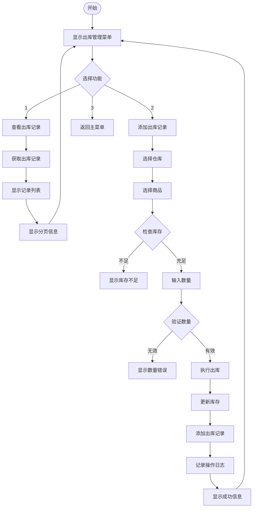

```mermaid
flowchart TD
    Start([开始]) --> ShowMenu[显示出库管理菜单]
    ShowMenu --> SelectFunction{选择功能}
    
    SelectFunction -->|1| ViewStockOut[查看出库记录]
    SelectFunction -->|2| AddStockOut[添加出库记录]
    SelectFunction -->|3| ReturnMain[返回主菜单]
    
    ViewStockOut --> GetRecords[获取出库记录]
    GetRecords --> DisplayRecords[显示记录列表]
    DisplayRecords --> ShowPagination[显示分页信息]
    ShowPagination --> ShowMenu
    
    AddStockOut --> SelectWarehouse[选择仓库]
    SelectWarehouse --> SelectGoods[选择商品]
    SelectGoods --> CheckInventory{检查库存}
    CheckInventory -->|不足| ShowError[显示库存不足]
    CheckInventory -->|充足| InputQuantity[输入数量]
    InputQuantity --> ValidateQuantity{验证数量}
    ValidateQuantity -->|无效| ShowQuantityError[显示数量错误]
    ValidateQuantity -->|有效| ExecuteStockOut[执行出库]
    ExecuteStockOut --> UpdateInventory[更新库存]
    UpdateInventory --> AddStockRecord[添加出库记录]
    AddStockRecord --> LogOperation[记录操作日志]
    LogOperation --> ShowSuccess[显示成功信息]
    ShowSuccess --> ShowMenu 
```